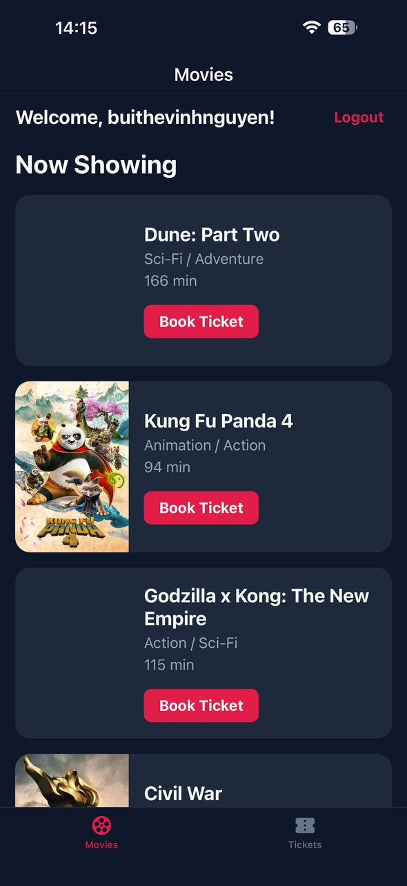
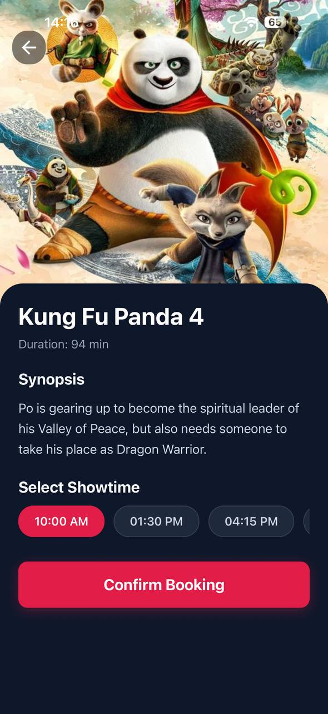
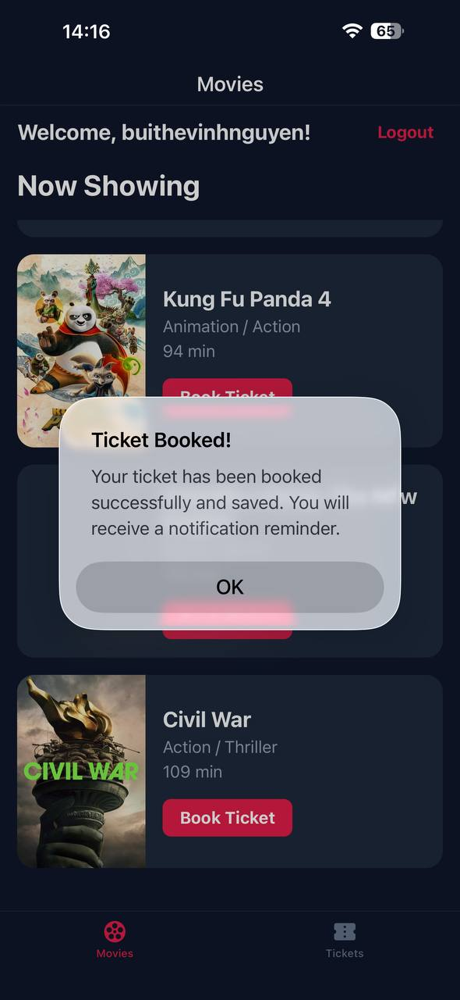
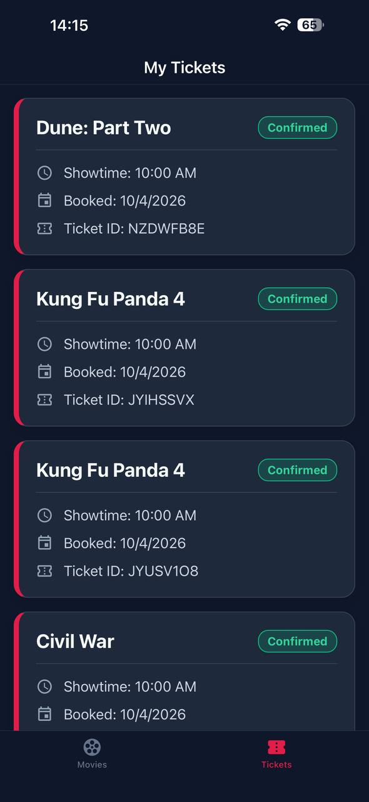

# Movie Ticket App 🎬

A premium React Native mobile application built with Expo and Firebase for booking movie tickets.

## Features ✨

- **User Authentication**: Secure login and management using Firebase Auth.
- **Movie Discovery**: Browse a curated list of "Now Showing" movies with high-quality posters.
- **Detailed Information**: View movie synopses and showtimes.
- **Easy Booking**: Seamless ticket booking process with instant confirmation.
- **Ticket Management**: Keep track of all your booked tickets in a dedicated "My Tickets" section.
- **Smart Notifications**: Local notifications to remind you of upcoming showtimes.

## Screenshots 📸

<div style="display: flex; flex-wrap: wrap; gap: 10px;">
  
  
  
  
</div>

## Technology Stack 🛠️

- **Framework**: [Expo](https://expo.dev/) (React Native)
- **Backend**: [Firebase](https://firebase.google.com/) (Firestore & Auth)
- **Routing**: [Expo Router](https://docs.expo.dev/router/introduction/)
- **Icons**: [@expo/vector-icons](https://icons.expo.fyi/)
- **Animations**: [React Native Reanimated](https://docs.swmansion.com/react-native-reanimated/)

## Getting Started 🚀

1. **Install dependencies**:
   ```bash
   npm install
   ```

2. **Setup Firebase**:
   Configure your environment variables in a `.env` file:
   ```env
   EXPO_PUBLIC_FIREBASE_API_KEY=your_api_key
   EXPO_PUBLIC_FIREBASE_AUTH_DOMAIN=your_auth_domain
   EXPO_PUBLIC_FIREBASE_PROJECT_ID=your_project_id
   EXPO_PUBLIC_FIREBASE_STORAGE_BUCKET=your_storage_bucket
   EXPO_PUBLIC_FIREBASE_MESSAGING_SENDER_ID=your_sender_id
   EXPO_PUBLIC_FIREBASE_APP_ID=your_app_id
   ```

3. **Start the app**:
   ```bash
   npx expo start
   ```

---
Built with ❤️ for Mobile PTIT
